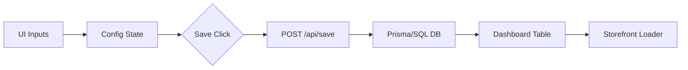

# Database & UI Table Design

This document details the transition from a flat JSON storage to a structured relational database and a premium UI table layout.

## 1. Relational Database Schema

### Table: `Shops`
| Column | Type | Constraints | Description |
| :--- | :--- | :--- | :--- |
| `id` | UUID / INT | Primary Key | Unique shop identifier. |
| `shop_domain` | String | Unique, Not Null | The `.myshopify.com` domain. |
| `access_token` | String | Not Null | Encrypted OAuth token. |
| `plan_name` | String | Default: 'free' | Subscription plan. |
| `status` | Enum | `active`, `uninstalled` | Installation state. |
| `installed_at` | DateTime | Default: `now()` | App install timestamp. |

### Table: `Templates`
| Column | Type | Constraints | Description |
| :--- | :--- | :--- | :--- |
| `id` | UUID / INT | Primary Key | Unique template ID. |
| `shop_id` | UUID / INT | Foreign Key → Shops.id | Owning shop. |
| `title` | String | Not Null | Template name. |
| `layout_type` | Enum | Not Null | `layout1`, `layout2`, etc. |
| `source` | JSON | Not Null | **Customization Data Object.** Stores the liquid file name, published URLs, and global styling tokens. |
| `is_active` | Boolean | Default: `TRUE` | Visibility toggle. |
| `created_at` | DateTime | Default: `now()` | Created time. |

### Table: `Discounts` (Stores Configuration)
*Note: This table serves as the configuration storage for each template.*
| Column | Type | Constraints | Description |
| :--- | :--- | :--- | :--- |
| `id` | UUID / INT | Primary Key | Unique record ID. |
| `template_id` | UUID / INT | FK → Templates.id (Unique) | One config per template. |
| `settings` | JSONB | Not Null | Nested configuration JSON. |
| `created_at` | DateTime | Default: `now()` | Created time. |
| `updated_at` | DateTime | Auto-updated | Last update timestamp. |

#### Nested Discount Schema (Stored within `settings`)
Instead of a separate table, discount details are stored directly inside the configuration JSON:
```json
{
  "layout": "layout4",
  "has_discount_offer": true,
  "discount_data": {
    "shopify_id": "gid://shopify/PriceRule/11223344",
    "code": "SUMMER20",
    "value": 20.0,
    "type": "percentage"
  },
  "max_selections": 5,
  "bg_color": "#ffffff"
}
```

---

## 2. Premium UI Table Design Specifications

### Visual Component: "The Elevated Row"
Instead of standard table rows, we use "Floating Cards" within the table body.

**CSS Styles:**
```css
.table-row {
  background: #ffffff;
  border-radius: 12px;
  margin-bottom: 12px;
  box-shadow: 0 2px 4px rgba(0,0,0,0.02);
  transition: all 0.3s cubic-bezier(0.165, 0.84, 0.44, 1);
  border: 1px solid #f0f1f2;
}

.table-row:hover {
  transform: translateY(-3px);
  box-shadow: 0 10px 20px rgba(0,0,0,0.06);
  border-color: #e2e4e6;
}

.layout-preview-thumb {
  width: 48px;
  height: 48px;
  border-radius: 8px;
  background: #f8f9fa;
  display: flex;
  align-items: center;
  justify-content: center;
}
```

### Table Interaction Flow
1. **Selection**: Checkboxes appear on the left with a custom purple glow when checked.
2. **Status Toggle**: A custom sliding switch for "Active" status instead of a simple checkbox.
3. **Smart Sorting**: Columns like "Created Date" or "Performance" support instant AJAX sorting.
4. **Action Menu**: A "Three-dot" menu or a row of iconic buttons (Edit, Duplicate, Delete) that appear on hover.

---

## 3. Data Flow Diagram (JSON to UI)

